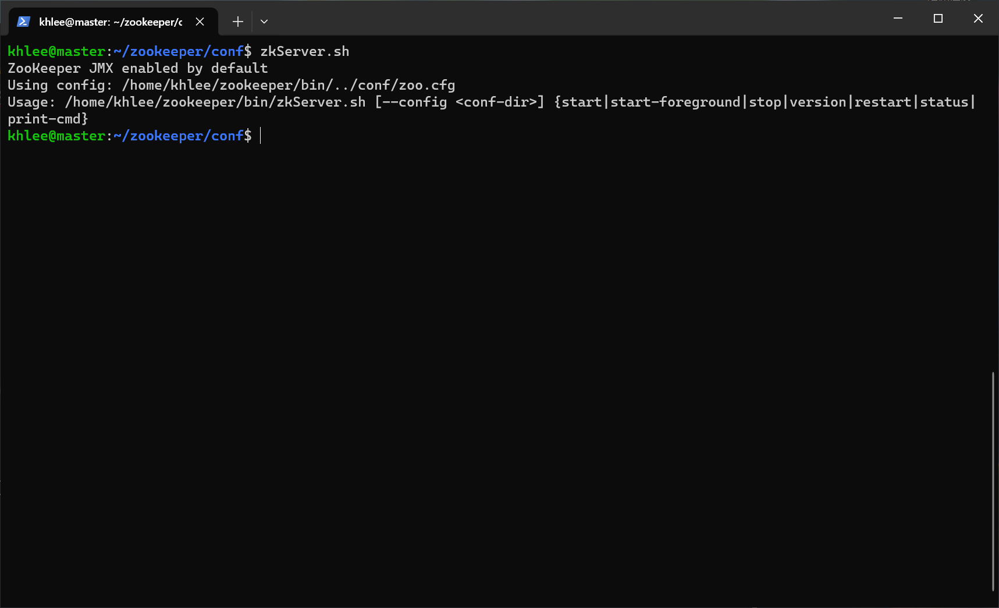
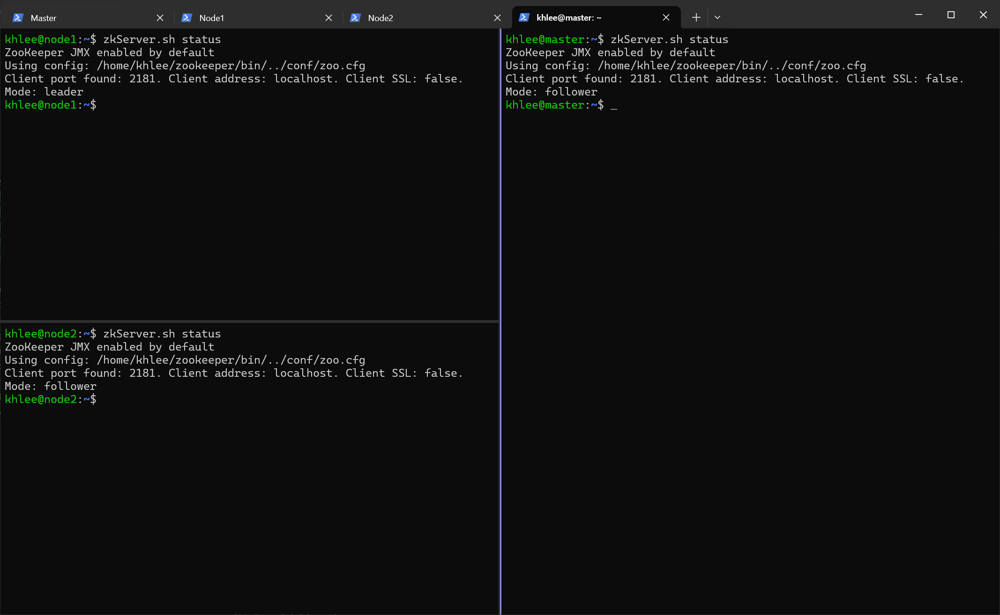
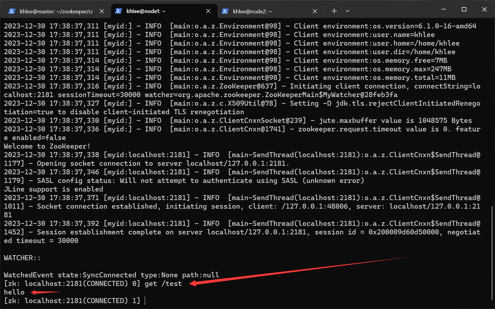
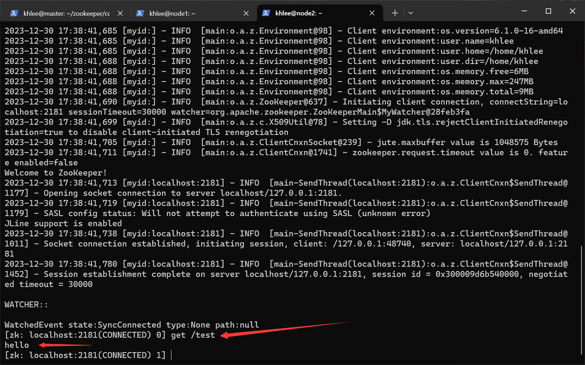

# Zookeeper 安装

## 先决条件

- 确保 Hadoop 集群已经启动
- [apache-zookeeper-3.8.3-bin.tar.gz](https://zookeeper.apache.org/releases.html)（位于 `~/Downloads`）
- 分布式搭建

**我的用户名是 khlee，所以下面出现的所有 khlee 字眼请全部根据自己的实际用户名填写。**

## 假设

| 虚拟机序号 |    虚拟机 IP    | 主机名 |
| :--------: | :-------------: | :----: |
|     1      | 192.168.100.100 | master |
|     2      | 192.168.100.101 | node1  |
|     3      | 192.168.100.102 | node2  |

## 1.解压

> 注意：请在 master 节点上操作

```bash
cd ~/Downloads

tar -zxf ./apache-zookeeper-3.8.3-bin.tar.gz
mv ./apache-zookeeper-3.8.3-bin ../zookeeper
```

## 2.配置 zookeeper

> 注意：请在 master 节点上操作

创建 `data` 目录用于存储数据：

```bash
mkdir ~/zookeeper/data
```

创建 `logs` 目录用于存储日志：

```bash
mkdir ~/zookeeper/logs
```

进入配置文件夹：

```bash
cd ~/zookeeper/conf
```

以 zoo_sample.cfg 为模板创建配置：

```bash
cp ./zoo_sample.cfg ./zoo.cfg
```

打开配置文件：

```bash
vim ./zoo.cfg
```

修改后：

```bash
# The number of milliseconds of each tick
tickTime=2000
# The number of ticks that the initial
# synchronization phase can take
initLimit=10
# The number of ticks that can pass between
# sending a request and getting an acknowledgement
syncLimit=5
# the directory where the snapshot is stored.
# do not use /tmp for storage, /tmp here is just
# example sakes.
dataDir=/home/khlee/zookeeper/data
dataLogsDir=/home/khlee/zookeeper/logs
# the port at which the clients will connect
clientPort=2181
# the maximum number of client connections.
# increase this if you need to handle more clients
#maxClientCnxns=60
#
# Be sure to read the maintenance section of the
# administrator guide before turning on autopurge.
#
# https://zookeeper.apache.org/doc/current/zookeeperAdmin.html#sc_maintenance
#
# The number of snapshots to retain in dataDir
#autopurge.snapRetainCount=3
# Purge task interval in hours
# Set to "0" to disable auto purge feature
#autopurge.purgeInterval=1

## Metrics Providers
#
# https://prometheus.io Metrics Exporter
#metricsProvider.className=org.apache.zookeeper.metrics.prometheus.PrometheusMetricsProvider
#metricsProvider.httpHost=0.0.0.0
#metricsProvider.httpPort=7000
#metricsProvider.exportJvmInfo=true

# 添加这个配置才能用 create -t ttl /node_name
extendedTypesEnabled=true

# servers
server.1=master:2888:3888
server.2=node1:2888:3888
server.3=node2:2888:3888
```

---

## 3.配置环境变量

> 注意：请在 master 节点上操作

编辑环境变量：

```bash
env-edit
```

在末尾追加以下内容：

```bash
export ZK_HOME=/home/khlee/zookeeper
export PATH=$PATH:$ZK_HOME/bin:$JAVA_HOME/bin
```

生效环境变量：

```bash
env-update
```

测试：

```bash
zkServer.sh
```



## 4.分发文件

> 注意：请在 master 节点上操作

分发 zookeeper：

```bash
scp -r ~/zookeeper node1:~/ &
scp -r ~/zookeeper node2:~/
```

下发环境变量：

```bash
env-sync-to-node1
env-sync-to-node2
```

## 5.生效环境变量

> 注意：请在所有节点上操作

```bash
env-update
```

## 6.配置 myid

> 注意：请在 master 节点上操作

每台服务器的 myid 必须是唯一的。其实我们上一步已经为每一节点分配好了 myid，它在 `zoo.cfg` 的最下方，就像这样：

```bash
# server.myid=主机名:2888:3888

# master 节点的 myid 是 1
server.1=master:2888:3888

# node1 节点的 myid 是 2
server.2=node1:2888:3888

# node2 节点的 myid 是 3
server.3=node2:2888:3888
```

设置 master 节点的 myid：

```bash
echo 1 > ~/zookeeper/data/myid
```

设置 node1 节点的 myid：

```bash
# 语法：ssh [主机名@]地址 "远程执行的命令"
ssh node1 "echo 2 > ~/zookeeper/data/myid"
```

设置 node2 节点的 myid：

```bash
ssh node2 "echo 3 > ~/zookeeper/data/myid"
```

## 7.启动与测试

在所有节点上执行此命令来启动 Zookeeper：

```bash
# zkServer.sh 支持下列参数：
# start | start-foreground | stop | restart | status | upgrade | print-cmd
zkServer.sh start
```

分别检查三个节点的 Zookeeper Server 状态：

```bash
zkServer.sh status
```



在 master 节点打开 Zookeeper Cli：

```bash
zkCli.sh
```

在 master 节点的 Zookeeper Cli 里执行此命令：

```bash
create /test "hello"
```


在 slave1 节点打开 Zookeeper Cli：

```bash
zkCli.sh
```

在 node1 节点的 Zookeeper Cli 执行此命令：

```bash
get /test
```



在 node2 节点打开 Zookeeper Cli：

```bash
zkCli.sh
```

在 node2 节点的 Zookeeper Cli 执行此命令：

```bash
get /test
```



node1 与 node2 均出现 "hello" 即视为部署成功。

## 后续问题

如果下次启动时发现无法启动，三个节点怎么都连不上。

那么请在各个节点上执行 `zkServer.sh restart` 命令重启 Zookeeper Server，直到它恢复为止。

这不是你的错。

## 快速跳转

[回到顶部](#zookeeper-安装)

[MySQL 安装](../mysql/README.md)
