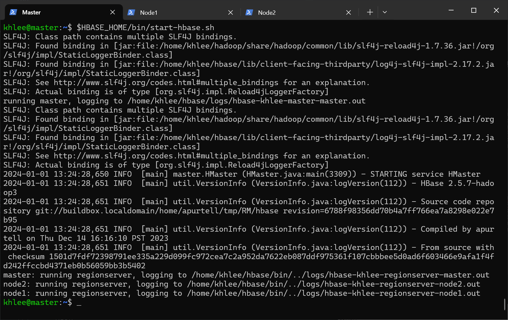
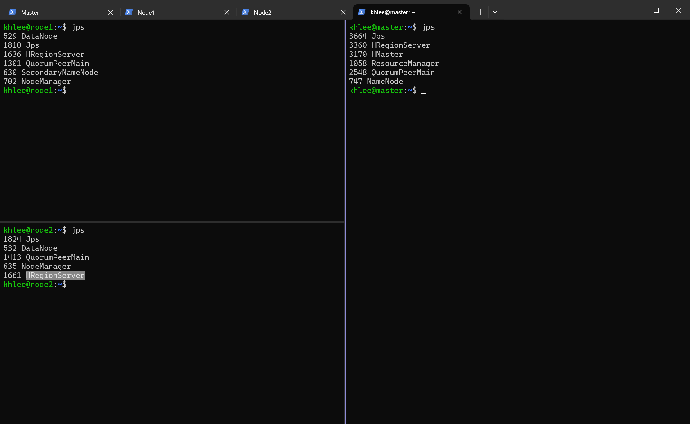

# HBase 搭建文档

## 先决条件

- Hadoop 集群已经启动
- MySQL 已经启动
- Hive 已部署完毕
- Zookeeper 已经启动
- [hbase-2.5.7-hadoop3-bin.tar.gz](https://www.apache.org/dyn/closer.lua/hbase/2.5.7/hbase-2.5.7-hadoop3-bin.tar.gz)（位于 `~/Downloads`）
- 分布式搭建

**我的用户名是 khlee，所以下面出现的所有 khlee 字眼请全部根据自己的实际用户名填写。**

## 1.解压

> 注意：请在 master 节点上操作

解压 hbase-2.5.7-hadoop3-bin.tar.gz 到当前目录：

```bash
cd ~/Downloads/
tar -zxf ./hbase-2.5.7-hadoop3-bin.tar.gz
mv ./hbase-2.5.7-hadoop3 ../hbase
```

重命名 hbase ：

```bashl
mv ./hbase-2.2.3 ./hbase
```

## 2.配置环境变量

> 注意：请在 master 节点上操作

编辑环境变量：

```bash
env-edit
```

在文件末尾添加：

```bash
# 此处不再将 hbase/bin/* 导出到环境变量，原因自行体会
export HBASE_HOME=~/hbase
```

生效环境变量：

```bash
env-update
```

## 3.修改配置文件

> 注意：请在 master 节点上操作

进入配置文件目录：

```bash
cd ~/hbase/conf/
```

编辑 hbase-env.sh：

```bash
vim ./hbase-env.sh
```

找到并取消注释，然后修改:

```bash
# 配置 Java 环境变量
export JAVA_HOME=~/jdk/

# 不使用独立部署的 zookeeper
export HBASE_MANAGES_ZK=false

# 禁止 Hbase 查找 Hadoop 的 Classs 以防止冲突问题
# export HBASE_DISABLE_HADOOP_CLASSPATH_LOOKUP="false"
```

配置 hbase-site.xml：

进入配置文件目录：

```bash
cd ~/hbase/conf/
```

```bash
vim ./hbase-site.xml
```

配置后：

```xml
<?xml version="1.0"?>
<?xml-stylesheet type="text/xsl" href="configuration.xsl"?>

<configuration>
    <!-- HBase 的数据保存在 HDFS 下 -->
    <property>
        <name>hbase.rootdir</name>
        <value>hdfs://master:9000/hbase</value>
    </property>

    <!-- 是否是分布式环境 -->
    <property>
        <name>hbase.cluster.distributed</name>
        <value>true</value>
    </property>

    <!-- Zookeeper 客户端端口号 -->
    <property>
        <name>hbase.zookeeper.property.clientPort</name>
        <value>2181</value>
    </property>

    <!--
    Zookeeper Quorum 中的服务器列表
    使用逗号分隔。在完全分布式模式下，需要把所有 Zookeeper Quorum 节点添加进去
    如果在 hbase-env.sh 文件中设置了 HBASE_MANAGES_ZK=false，则此列表中的节
    点就是我们启动或停止 Zookeeper 服务的节点。
    -->
    <property>
        <name>hbase.zookeeper.quorum</name>
        <value>master,node1,node2</value>
    </property>

    <!-- HBase 的本地缓存目录 -->
    <property>
        <name>hbase.tmp.dir</name>
        <value>/home/khlee/hbase/tmp</value>
    </property>

    <!-- 默认项，不需要修改 -->
    <property>
        <name>hbase.unsafe.stream.capability.enforce</name>
        <value>false</value>
    </property>
</configuration>
```

修改配置文件（master 节点）：

```bash
vim ./regionservers
```

删掉默认的内容并将内容改为：

```bash
node1
node2
```

## 可选步骤 1 - 与 Hadoop 冲突

> 注意：请在 master 节点上操作

```bash
cd $HBASE_HOME/lib/client-facing-thirdparty/

mv ./slf4j-api-1.7.33.jar ./slf4j-api-1.7.33.jar.bak
```

## 4.分发文件

> 注意：请在 master 节点上操作

可以先删掉 `~/hbase/docs` 文档目录，这样发送起来更快。

分发文件到 `node1`、`node2` ：

```bash
scp -r ~/hbase node1:~/ &
scp -r ~/hbase node2:~/
```

## 5.启动测试

> 注意：请在 master 节点上操作

***请确保 Zookeeper 已经启动***

执行命令：

```bash
start-hbase.sh
```



检查进程（三个节点）：

```bash
jps
```

master 节点从出现 Hmaster 进程，slave1、slave2 上出现 HregionServer 进程：



> 如果 node1、node2 上没有出现 HregionServer 进程，请参考 [FAQ](#hbase-没有正常启动) 部分章节。

浏览器打开 <http://192.168.100.100:16010> 端口查看 hbase 的 WebUI 启动情况：


## 6.HBase Shell

> 注意：请在 master 节点上操作

***请确保 Hadoop、Zookeeper 已启动***

进入 HBase 命令行：

```bash
$HBASE_HOME/bin/hbase shell
```

常用命令 - 表操作：

| 行为           | 命令                                               |
| -------------- | -------------------------------------------------- |
| 创建表         | `create '表名', '列簇名1', '列簇名2', '列簇名N'`   |
| 添加列簇       | `alter '表名', '列簇名'`                           |
| 删除列簇       | `alter '表名', {NAME=>'列簇名', METHOD=>'delete'}` |
| 启用/禁用表    | `enable/disable '表名'`                            |
| 是否启用/禁用  | `is_enabled/is_disabled`                           |
| 删除表         | 仅能删除已被禁用的表：`drop '表名'`                |
| 查看表结构     | `describe '表名'`                                  |
| 检查表是否存在 | `exists '表名'`                                    |

常用命令 - 增删改查：

| 行为           | 命令                                    |
| -------------- | --------------------------------------- |
| 添加记录       | `put '表名', '行键', '列簇:列名', '值'` |
| 删除记录       | `delete '表名', '行键', '列簇:列名'`    |
| 删除整行的值   | `deleteall '表名', '行键'`              |
| 更新记录       | 再添加一次，覆盖原来的（put）           |
| 查看记录       | `get '表名', '行键'`                    |
| 查看表中记录数 | `count '表名'`                          |

常用命令 - 搜索：

| 行为                                                      | 命令                                                                                   |
| --------------------------------------------------------- | -------------------------------------------------------------------------------------- |
| 扫描整张表                                                | `scan '表名'`                                                                          |
| 扫描整个列簇                                              | `scan '表名', {COLUMN=>'列簇'}`                                                        |
| 查看某表某列所有数据                                      | `scan '表名', {COLUMN=>'列簇:列名'}`                                                   |
| 限制查询结果行数（先根据 RowKey 定位 Region，再向后扫描） | `scan '表名', {STARTROW=>'起始行名', LIMIT=>行数, VERSIONS=>版本数}`                   |
| 限制查询结果行数（先根据 RowKey 定位 Region，再向后扫描） | `scan '表名', {STARTROW=>'起始行名', STOPROW=>终止行名, VERSIONS=>版本数}`             |
| 限制查询结果行数（先根据 RowKey 定位 Region，再向后扫描） | `scan '表名', {TIMERANGE=>[起始时间戳（毫秒）, 终止时间戳（毫秒）], VERSIONS=>版本数}` |
| 使用等值过滤进行搜索                                      | `scan '表名', FILTER=>"ValueFilter(=, 'binary': 值)"`                                  |
| 使用值包含子串过滤进行搜索                                | `scan '表名', FILTER=>"ValueFilter(=, 'subsreing': 字串)"`                             |
| 使用列名的前缀进行搜索                                    | `scan '表名', FILTER=>"ColumnPrefixFilter('前缀')"`                                    |
| 使用 RowKey 的前缀进行搜索                                | `scan '表名', FILTER=>"PrefixFilter('前缀')"`                                          |

退出 hbase 命令行:

```bash
exit
```

## HBase 没有正常启动

确保所有节点的时区一致、时间误差 ±3s。

检查时区：

```bash
date -R
```

通过 ntp 工具联网校时：

```bash
# 安装 ntpdate
sudo apt install ntpdate

# 同步网络时间
ntpdate cn.pool.ntp.org
```

如果没有网络环境，也可以通过手动设置时间来减小节点之间的误差：

```bash
date -s "hh:mm:ss"
ssh slave1 "date -s 'hh:mm:ss'"
ssh slave2 "date -s 'hh:mm:ss'"
```

## 快速跳转

[回到顶部](#HBase-搭建文档)

[Scala 安装](../scala/README.md)
