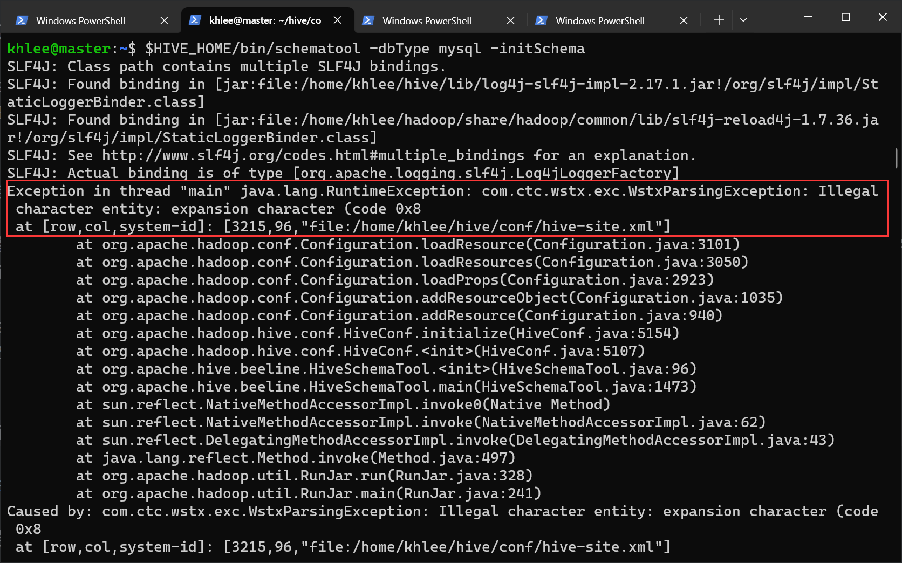
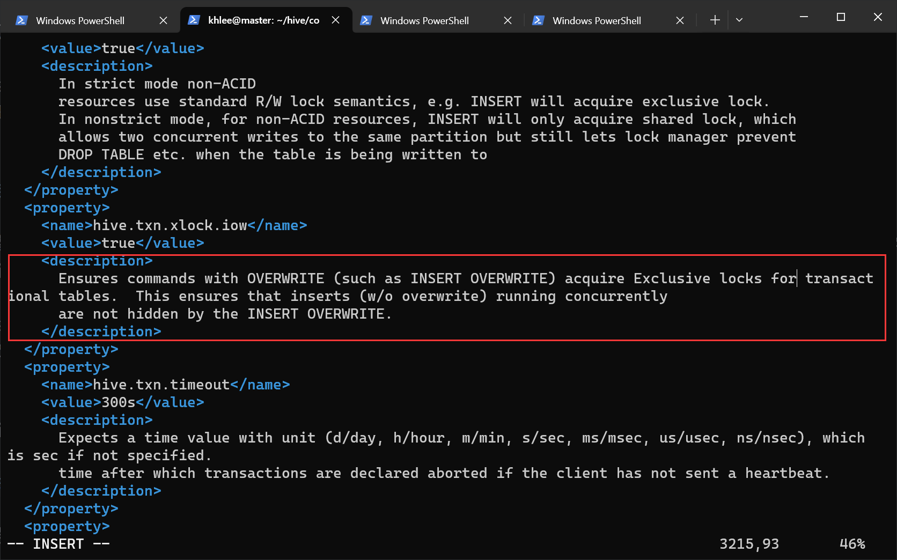
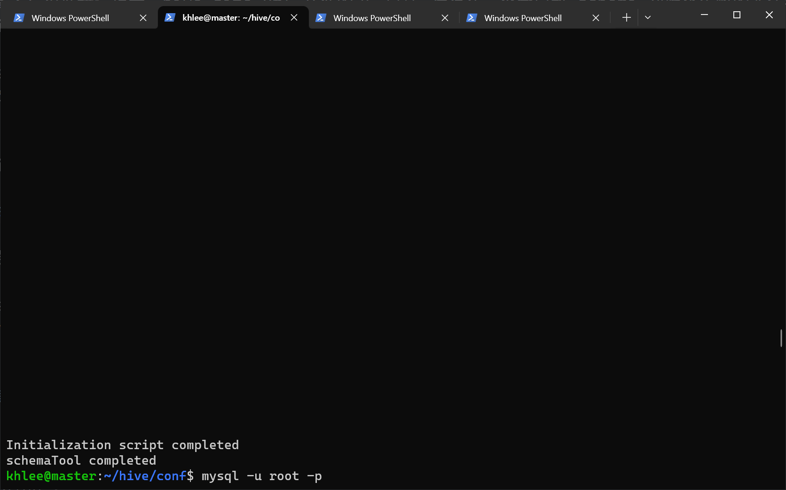
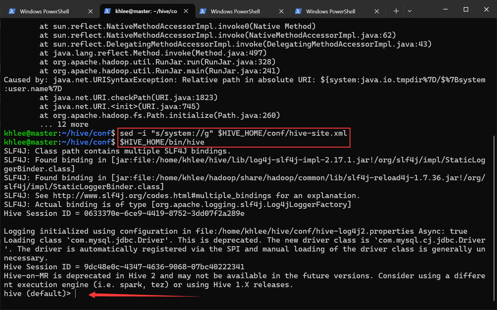
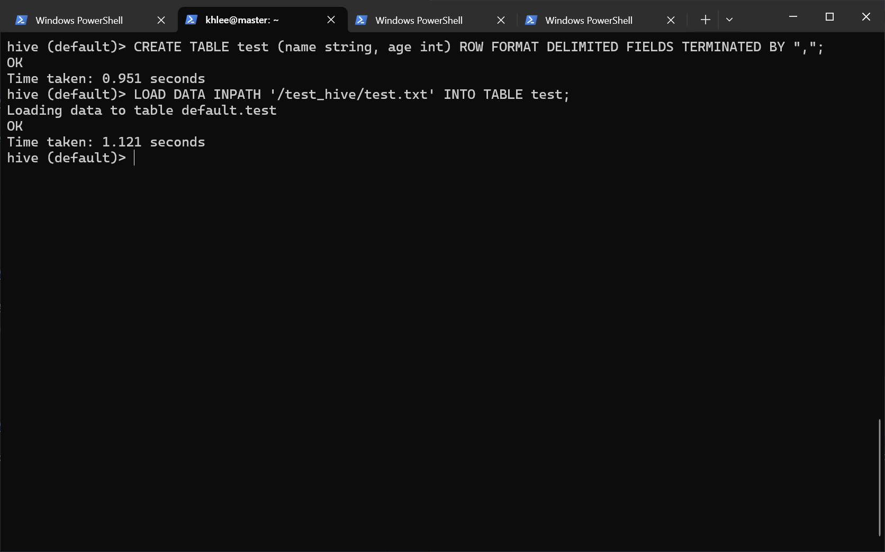
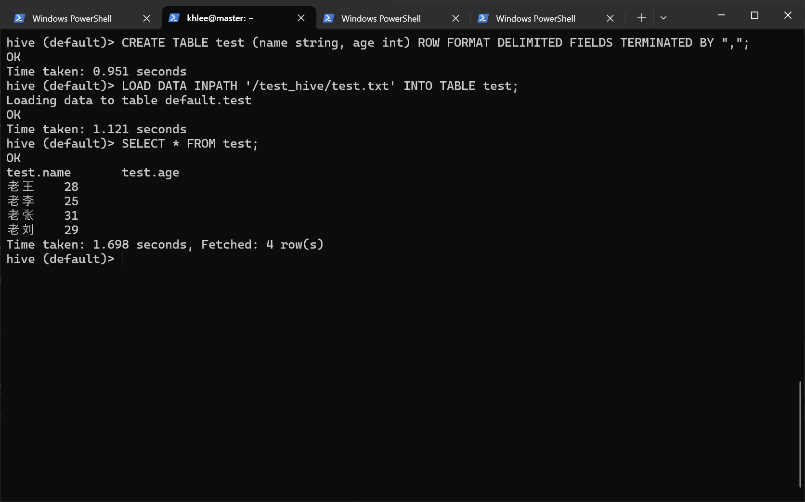
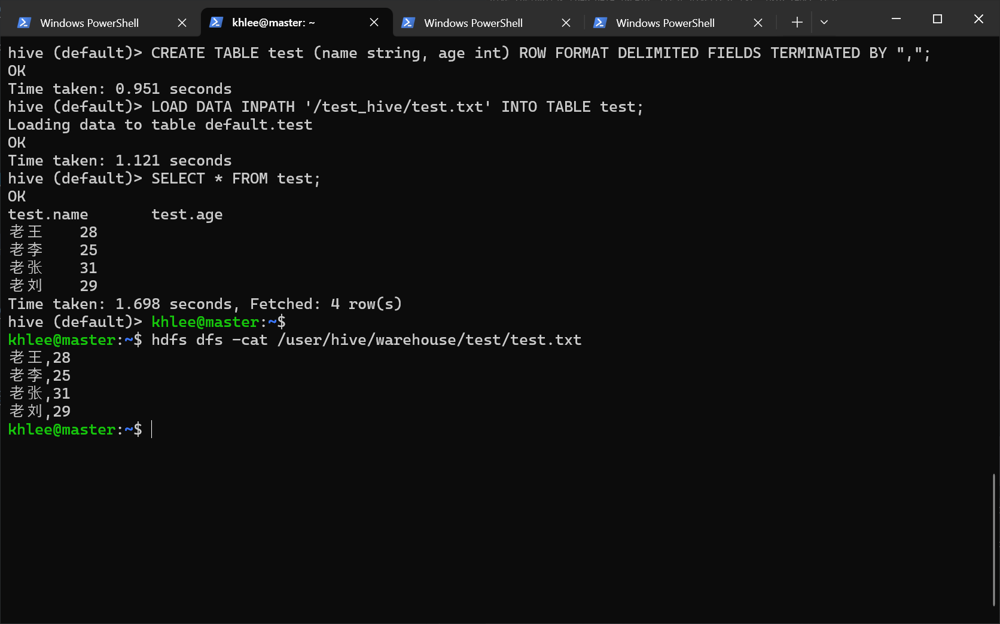

# HIVE 搭建文档

## 先决条件

- 确保 Hadoop 集群已经启动
- 确保 MySQL 已经启动
- [apache-hive-3.1.3-bin.tar.gz](https://dlcdn.apache.org/hive/hive-3.1.3/)（位于 `~/Downloads`）
- [mysql-connector-j-8.2.0.tar.gz](https://dev.mysql.com/downloads/connector/j/)（位于 `~/Downloads`）
- 单机搭建

**我的用户名是 khlee，所以下面出现的所有 khlee 字眼请全部根据自己的实际用户名填写。**

## 1.解压 Hive 并重命名

```bash
cd ~/Downloads
tar -zxf ./apache-hive-3.1.3-bin.tar.gz
mv ./apache-hive-3.1.3-bin ../hive
```

## 2.置入 jar 包

因为 Hive 需要操作 MySQL，所以需要将 Java 连接 MySQL 需要用到的驱动复制到 hive/lib/ 下：

```bash
cd ~/Downloads
tar -zxf ./mysql-connector-j-8.2.0.tar.gz
mv ./mysql-connector-j-8.2.0/mysql-connector-j-8.2.0.jar ../hive/lib/
rm -rf ./mysql-connector-j-8.2.0
```

## 3.配置环境变量

编辑环境变量：

```bash
env-edit
```

在文件末尾添加：

```bash
# 此处不再将 hive/bin/* 导出到环境变量，原因自行体会
export HIVE_HOME=~/hive
```

生效环境变量

```bash
env-update
```

## 4.配置 Hive

进入 Hive 配置目录：

```bash
cd $HIVE_HOME/conf
```

### hive-env.sh

拷贝模板：

```bash
cp ./hive-env.sh.template ./hive-env.sh
```

编辑 hive-env.sh：

```bash
vim ./hive-env.sh
```

在文件末尾添加：

```bash
export JAVA_HOME=/opt/apps/jdk
export HADOOP_HOME=/opt/apps/hadoop
export HIVE_HOME=/opt/apps/hive
export HIVE_CONF_DIR=$HIVE_HOME/conf
```

### hive-site.xml

拷贝模板：

```bash
cp ./hive-default.xml.template ./hive-site.xml
```

编辑 hive-site.xml：

```bash
vim ./hive-site.xml
```

修改以下配置：

> 直接在 hive-site.xml 文件查找对应项修改参数，切勿全部删除！！！
> vim 编辑器命令模式下使用 "/关键字" 搜索，按 N 键跳转到下一个搜索结果。

```xml
<!--配置数据库地址-->
<property>
 <name>javax.jdo.option.ConnectionURL</name>
 <value>jdbc:mysql://localhost:3306/hivedb?createDatabaseIfNotExist=true&amp;useSSL=false</value>
</property>
<!--配置数据库驱动-->
<property>
 <name>javax.jdo.option.ConnectionDriverName</name>
 <value>com.mysql.jdbc.Driver</value>
</property>
<!--配置数据库用户名-->
<property>
 <name>javax.jdo.option.ConnectionUserName</name>
 <value>你的 mysql 账号</value>
</property>
<!--配置MySQL数据库root的密码-->
<property>
 <name>javax.jdo.option.ConnectionPassword</name>
 <value>你的 mysql 密码</value>
</property>
<!-- 在 hibe cli 内显示当前所在的数据库 -->
<property>
 <name>hive.cli.print.current.db</name>
 <value>true</value>
</property>
<!-- 在 hibe cli 内显示表头 -->
<property>
 <name>hive.cli.print.header</name>
 <value>true</value>
</property>
<!-- 关闭版本验证 -->
<property>
 <name>hive.metastore.schema.verification</name>
 <value>false</value>
</property>
<!-- 以本地模式运行 -->
<property>
 <name>hive.exec.mode.local.auto</name>
 <value>true</value>
</property>

```

### 配置 log4j.properties

拷贝模板：

```bash
cp hive-log4j2.properties.template hive-log4j2.properties
```

## 5.schema 初始化

执行初始化：

```bash
$HIVE_HOME/bin/schematool -dbType mysql -initSchema
```



根据错误提示，hive-site.xml 文件的第 3215 行存在一个会导致 schema 初始化失败的非法字符，我们来编辑 hive-site.xml：

```bash
vim $HIVE_HOME/conf/hive-site.xml
```

在 vim 命令模式下输入 `:3215` 来快速跳转到第 3215 行，删掉 `&#8;` 这四个字符：



再次尝试初始化：

```bash
$HIVE_HOME/bin/schematool -dbType mysql -initSchema
```



## 6.启动 Hive

启动 Hive ：

```bash
$HIVE_HOME/bin/hive
```

如果出现这个报错：（绝对URI中的相对路径）


解决方案是把 hive-site.xml 文件中绝对路径字眼 “system:” 全部删掉：

```bash
# sed 命令用于批量替换文本内容
# sed -i "s/要替换的/替换为/g" 目标文件路径
sed -i "s/system://g" $HIVE_HOME/conf/hive-site.xml
```

再次尝试启动 Hive：

```bash
$HIVE_HOME/bin/hive
```

成功：



输入 `exit;` 或按下 `ctrl + d` 即可退出 Hive Cli。

## 7.使用 Hive

目的：使用 Hive 处理存储在 HDFS 内的结构化数据，使得我们可以通过 SQL 语句操作这些数据。

我们先来创建一个结构化的数据：

```bash
vim ~/test.txt
```

写入这些东西：

```text
老王,28
老李,25
老张,31
老刘,29
```

在 HDFS 里创建一个 test_hive 目录：

```bash
hdfs dfs -mkdir /test_hive
```

把我们刚刚写的 test.txt 发送到 hdfs 文件系统的 /test_hive 目录里 ：

```bash
hdfs dfs -put ~/test.txt /test_hive/test.txt
```

> 如果发送文件到 HDFS 时遇到错误，请尝试重启您的 Hadoop。
>
> ```bash
> # 停止 Hadoop 集群
> stop-yarn.sh && stop-dfs.sh
>
> # 启动 Hadoop 集群
> start-dfs.sh && start-yarn.sh
> ```
>
> 如果还是不行，请尝试此方案（会清空 HDFS 内所有的数据）：
>
> ```bash
> # 停止 Hadoop 集群
> stop-yarn.sh && stop-dfs.sh
>
> # 清空您在 core-site.xml 里设置的 hadoop.tmp.dir 目录（在所有节点上执行这句）
> rm -rf $HADOOP/tmp
>
> # 重新格式化 NameNode（在 master 节点上执行这句）
> hdfs namenode -format
>
> # 启动 Hadoop 集群
> start-dfs.sh && start-yarn.sh
> ```
>
> 具体请参考 [Hadoop 搭建文档](../hadoop/README) 第八步的引用部分。

回到正题，cat 一下，证明已经发送到 HDFS 里了：

```bash
hdfs dfs -cat /test_hive/test.txt
```


启动 Hive ：

```bash
$HIVE_HOME/bin/hive
```

创建一个拥有两个字段 name 和 age 的数据表 test。这个表以 “,” 分隔列、以 “\n” 分隔行：

```sql
CREATE TABLE test (
 name string,
 age int
) ROW FORMAT DELIMITED FIELDS TERMINATED BY ",";
```


从 HDFS 导入 `/test_hive/test.txt` 内的数据到 test 数据表：

```sql
-- LOAD DATA INPATH 'HDFS 路径' INTO TABLE 表名;
LOAD DATA INPATH '/test_hive/test.txt' INTO TABLE test;
```



执行一个熟悉的命令来验证下：

```sql
SELECT * FROM test;
```



输入 `exit` 或按下 `ctrl + d` 退出 Hive：

```bash
exit;
```

在 HDFS 里可查看到 Hive 的数据表信息：

```bash
hdfs dfs -cat /user/hive/warehouse/test/test.txt
```



## 快速跳转

[回到顶部](#hive-搭建文档)

[Sqoop 搭建文档](../sqoop/README.md)
