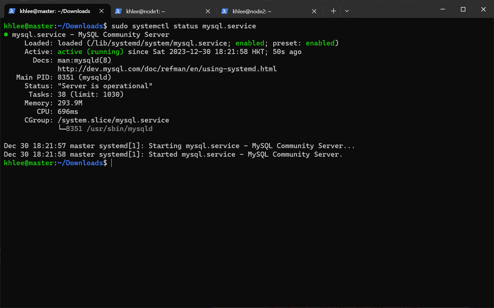

# MySQL 安装

## 先决条件

- [mysql-server_8.2.0-1debian12_amd64.deb-bundle.tar](https://dev.mysql.com/downloads/mysql/)（位于 `~/Downloads`）
- 单机搭建

**我的用户名是 khlee，所以下面出现的所有 khlee 字眼请全部根据自己的实际用户名填写。**

## 1.安装软件包

```bash
cd ~/Downloads
tar -xf ./mysql-server_8.2.0-1debian12_amd64.deb-bundle.tar
sudo dpkg -i ./libmysqlclient*.deb
sudo dpkg -i ./mysql-*.deb
```

如果这一步出现意外，一般是因为依赖缺失导致的，可以通过这个命令修复一下：

```bash
# 此命令需要网络
sudo apt --fix-broken install
```

过一会就会出现蓝色的界面提示设置 root 密码，记得设置一下。设置完之后会提示你选择默认的密码验证插件，这里我们选择第二个：


清理安装包：

```bash
cd ~/Downloads
rm ./libmysqlclient*.deb ./mysql-*.deb
```

## 2.启动 MySQL 并设置开机自启

查看 mysql 守护进程状态：

```bash
sudo systemctl status mysql.service
```

如果 mysqld 没有启动，则手动启动它：

```bash
sudo systemctl start mysql.service
```

默认情况下 mysql 会自动设置开机启动，如果没有则进行一个手动操作：

```bash
sudo systemctl enable mysql.service
```

再次查看 mysqld 守护进程状态：

```bash
sudo systemctl status mysql.service
```



## 3.配置 MySQL

以 root 身份登录到 MySQL：

```bash
mysql -u root -p
```

创建一个用于远程登陆的用户：

```sql
/*
  在开发环境建议这么做，在生产环境上是很危险的操作
  'root'@'%' 表示任何主机的 root 账户
*/
CREATE USER 'root'@'%' IDENTIFIED BY '用户的密码';
```

完全允许 root 远程连接：
命令解释：

- GRANT：赋权命令
- ALL PRIVILEGES：当前用户的所有权限
- ON：介词
- \*.\*：当前用户对所有数据库和表的操作权限
- TO：介词
- 'root'@'%'：权限赋给 root 用户，所有 ip 都能连接
- WITH GRANT OPTION：允许级联赋权

```sql
/*
  在开发环境建议这么做，在生产环境上是很危险的操作。
*/
GRANT ALL PRIVILEGES ON *.* TO 'root'@'%' WITH GRANT OPTION;
```

刷新权限：

```sql
FLUSH PRIVILEGES;
```

不要忘了退出 MySQL：

```bash
\q
```

## 快速跳转

[回到顶部](#MySQL-安装)

[MySQL 基础](../../lang/sql/README.md)

[MySQL 进阶](../../lang/sql_adv/README.md)

[Hive 安装](../hive/README.md)
