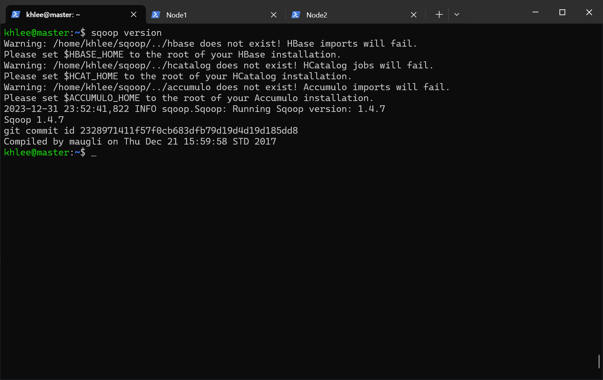

# Sqoop 安装

## 警告

***Sqoop、Sqoop2 已与 2021 年停止维护。这意味着 Sqoop 已经过时并且不再是我们首要考虑的工具集。将它与最新的 Hadoop 一同使用是不明智的，出现一些兼容问题也是在所难免的。如非必要，请使用替代品而不是已经过时的 Sqoop。***

***此页面的内容不再维护***

## 先决条件

- [Debian GNU/Linux 12 (bookworm) x86_64](https://mirrors.tuna.tsinghua.edu.cn/debian-cd/12.4.0/amd64/iso-cd/)
- 确保 Hadoop 集群已经启动
- 确保 MySQL8.2.0 已经启动
- 确保 Hive 已部署完毕
- [mysql-connector-j-8.2.0.tar.gz](https://dev.mysql.com/downloads/connector/j/)（位于 `~/Downloads`）
- [sqoop-1.4.7.bin\_\_hadoop-2.6.0.tar.gz](https://archive.apache.org/dist/sqoop/1.4.7/)（位于 `~/Downloads`）
- 非分布式搭建

**我的用户名是 khlee，所以下面出现的所有 khlee 字眼请全部根据自己的实际用户名填写。**

## 1.解压

解压 Sqoop 并重命名：

```bash
cd ~/Downloads
tar -zxf ./sqoop-1.4.7.bin__hadoop-2.6.0.tar.gz
mv ./sqoop-1.4.7.bin__hadoop-2.6.0 ../sqoop
```

## 2.置入 MySQL 驱动包

因为我们要通过 Sqoop 操作 MySQL，所以需要将 Java 连接 MySQL 需要用到的驱动复制到 sqoop/lib 下：

```bash
cd ~/Downloads
cp ./mysql-connector-j-8.2.0.jar ../sqoop/lib/
```

## 3.配置环境变量

编辑环境变量：

```bash
env-edit
```

在文件末尾添加：

```bash
export SQOOP_HOME=~/sqoop
export PATH=$PATH:$SQOOP_HOME/bin
```

生效环境变量：

```bash
env-update
```

执行这条指令验证安装：

```bash
sqoop version
```



## 4.使用 Sqoop 前的准备工作

修改 MySQL 的配置文件：

```bash
vim /etc/my.cnf
```

在 my.cnf 配置文件中，bind-address 如果是 127.0.0.1，则 mysql 只接受本地连接，不接受远程连接。在 bind-address 后面增加远程访问 IP 地址或者注释掉这句话就可以远程登陆了。所以我们需要注释掉这一行：

````bash
# 没有下面这一行的话就无需这一步操作
#依照我们之前在[mysql 搭建文档](../mysql/README.md)说过的方法，完全允许 root 远程连接 mysql：
命令解释：

- GRANT：赋权命令
- ALL PRIVILEGES：当前用户的所有权限
- ON：介词
- \*.\*：当前用户对所有数据库和表的操作权- TO：介词
- 'root'@'%'：权限赋给 root 用户，所有 ip 都能连接
- WITH GRANT OPTION：允许级联赋权

```sql
/*
  在开发环境建议这么做，在生产环境上是很危险的操作。
*/
GRANT ALL PRIVILEGES ON *.* TO 'root'@'%' WITH GRANT OPTION;
````

刷新权限：

```sql
FLUSH PRIVILEGES;
```

创建一个用于测试 Sqoop 的数据库和表：

```sql
-- 创建 sqoop_test 数据库
CREATE DATABASE sqoop_test;

-- 创建 test 表
CREATE TABLE sqoop_test.test (
  name VARCHAR(50),
  age INT
) DEFAULT CHARSET=utf8;
```


插入一些数据：

```sql
INSERT INTO test VALUES
  ('张三', 20),
  ('李四', 24),
  ('王五', 22),
  ('王五', 22);
```


## 5.sqoop 指令菜单

查看 Sqoop 指令帮助：

```bash
sqoop help
```

| 命令              | 解释                                                                                      |
| ----------------- | ----------------------------------------------------------------------------------------- |
| import            | 导入数据到集群                                                                            |
| export            | 从集群导出数据                                                                            |
| codegen           | 生成与数据库记录交互的代码                                                                |
| create-hive-table | 创建 hive 表                                                                              |
| eval              | 查看 sql 执行结果                                                                         |
| import-all-tables | 导出某个数据库内的所有表到 hdfs                                                           |
| job               | 生成一个 job                                                                              |
| list-databases    | 列出所有数据库名称                                                                        |
| list-tables       | 列出某个数据库内的所有表                                                                  |
| merge             | 将 hdfs 中不同目录下的数据合在一起，并存放在指定的目录中                                  |
| metastore         | 记录 Sqoop job 的元数据信息，如果不启动 Metastore 实例，则默认的元数据存储日录为 ~/.sqoop |
| help              | 打印 sqoop 帮助信息                                                                       |
| version           | 打印 sqoop 版本信息                                                                       |

## 6.测试 Sqoop 连接 MySQL

使用 Sqoop 打印 MySQL 内所有数据库名：

> 通过 `sqoop help list-databases` 命令打印帮助信息。

```bash
sqoop list-databases \
--connect jdbc:mysql://localhost:3306 \
--username root \
-P
```


使用 Sqoop 打印 sqoop_test 数据库内所有的数据表名：

> 通过 `sqoop help list-tables` 命令打印帮助信息。

```bash
sqoop list-tables \
--connect jdbc:mysql://localhost:3306/sqoop_test \
--username root \
-P
```


## 7.导出 MySQL 数据表到 HDFS

> 通过 `sqoop help import` 命令打印帮助信息。

```bash
sqoop import \
--connect jdbc:mysql://localhos3306/sqoop_test \
--table test \
--username root \
-P \
--m 1
```

如果遇到这个错误：


错误原因：

- 使用了 localhost 或 127.0.0.1 作为数据库地址导致
- MySQL wait_timeout 参数时长设置过短
- MySQL 地址出错

两个解决方案：

- 修改 MySQL 的 wait_timeout 时长
- 将 url 中 localhost 或 127.0.0.1 修改为当前这台节点的内网 IP 或 内网 IP 映射（master）。

我们采用后面的方法。
删除之前导入的数据表：

```bash
hdfs dfs -rm -r /user/khlee/test
```

再次导入：

```bash
sqoop import \
--connect jdbc:mysql://master:3306/sqoop_test \
--table test \
--username root \
-P --m 1
```


如果卡在了 Running Job，请强制结束这些任务并重新尝试：

```bash
# 列出所有的任务
mapred job -list

# 通过 job id 强制结束他们
mapred job -kill 任务id
```

查看导入结果：

```bash
hdfs dfs -cat /user/khlee/test/part-m-00000
```


## 8.导出 HDFS 数据表到 MySQL

进入 MySQL ：

```bash
mysql -u root -p
```

在 sqoop_test 数据库创建一个 test_import 表：

```sql
CREATE TABLE sqoop_test.test_import (
  name VARCHAR(50),
  age INT
) DEFAULT CHARSET=utf8;
```

退出 MySQL，开始使用 Sqoop 导入数据：

```bash
sqoop export \
--connect jdbc:mysql://master:3306/sqoop_test \
--username root \
-P \
--table test_import \
--m 1 \
--export-dir /user/khlee/test \
--input-fields-terminated-by ","
```


登入 MySQL：

```bash
mysql -u root -p
```

查看下我们创建的 test_import 表：

```sql
SELECT * FROM sqoop_test.test_import;
```


## 解决从 hdfs 导入到 mysql 中的数据中，中文变问号的问题

进入 MySQL：

```bash
mysql -u root -p
```

查看编码信息：

```sql
SHOW VARIABLES LIKE 'character%';
```


可以看到有些地方的编码是 latin1，这种编码并不能显示中文。

退出数据库，编辑 my.cnf ：

```bash
sudo vim /etc/my.cnf
```

添加这两行到末尾：

```conf
character-set-server=utf8
init_connect='SET NAMES utf8'
```

重启 MySQL 服务：

```bash
sudo systemctl restart mysql.service
```

进入 MySQL 查看编码信息：

```sql
SHOW VARIABLES LIKE 'character%';
```


可以看到编码全是 utf8 了。接着重复第 8 步再操作一次即可。

## 快速跳转

[回到顶部](#Soop-安装)

[HBase 安装](../hbase/README.md)
