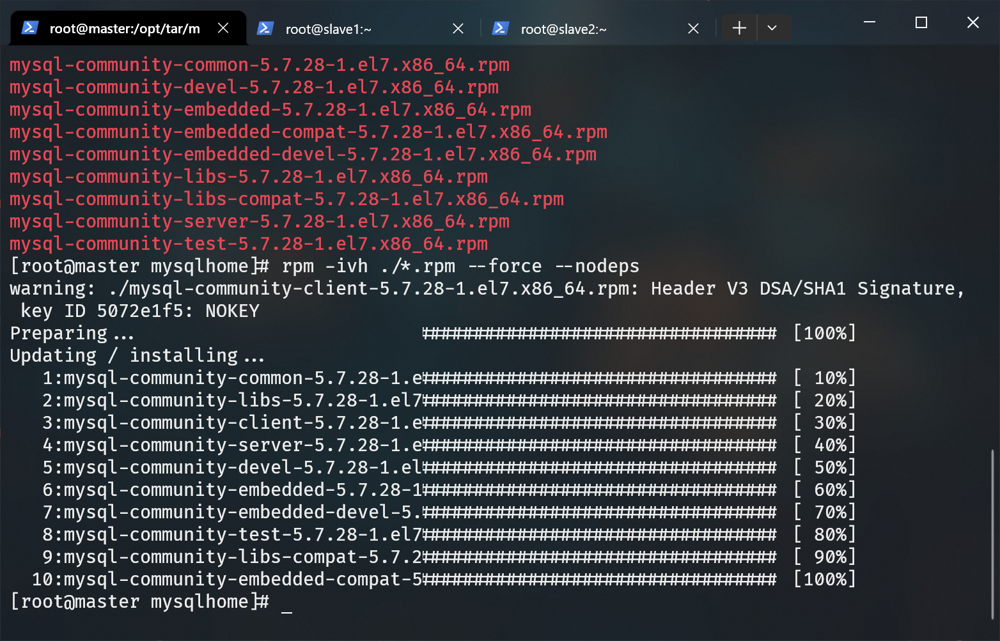
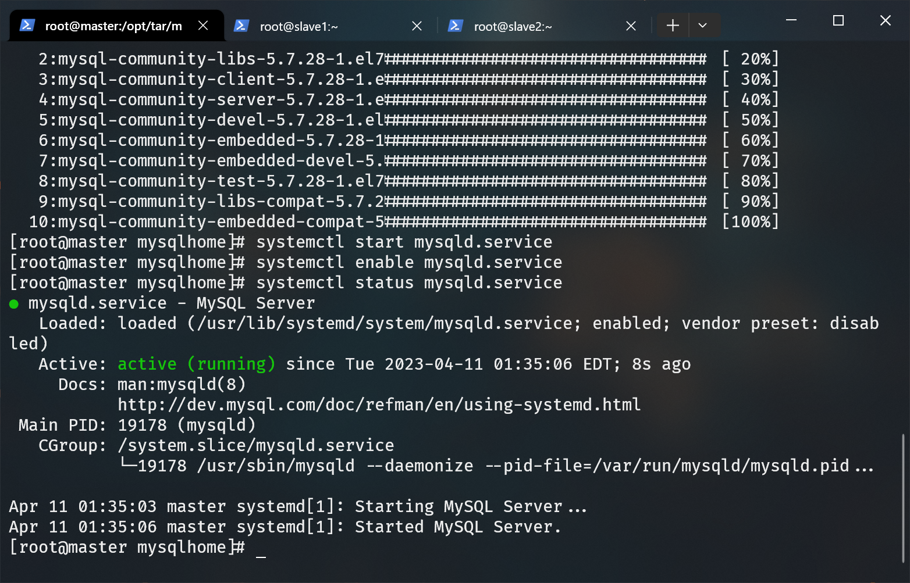

# MYSQL 搭建文档

## 前提条件
- mysql-5.7.28-1.el7.x86_64.rpm-bundle.tar（位于 /opt/tar/mysqlhome/）
- mysql-community-client-5.7.28-1.el7.x86_64.rpm（位于 /opt/tar/mysqlhome/）
- mysql-community-common-5.7.28-1.el7.x86_64.rpm（位于 /opt/tar/mysqlhome/）
- mysql-community-devel-5.7.28-1.el7.x86_64.rpm（位于 /opt/tar/mysqlhome/）
- mysql-community-embedded-5.7.28-1.el7.x86_64.rpm（位于 /opt/tar/mysqlhome/）
- mysql-community-embedded-compat-5.7.28-1.el7.x86_64.rpm（位于 /opt/tar/mysqlhome/）
- mysql-community-embedded-devel-5.7.28-1.el7.x86_64.rpm（位于 /opt/tar/mysqlhome/）
- mysql-community-libs-5.7.28-1.el7.x86_64.rpm（位于 /opt/tar/mysqlhome/）
- mysql-community-libs-compat-5.7.28-1.el7.x86_64.rpm（位于 /opt/tar/mysqlhome/）
- mysql-community-server-5.7.28-1.el7.x86_64.rpm（位于 /opt/tar/mysqlhome/）
- mysql-community-test-5.7.28-1.el7.x86_64.rpm（位于 /opt/tar/mysqlhome/）
- 非分布式搭建

---

## 1.安装软件包

进入 /opt/tar/MySQL/ 目录内：
``` bash
cd /opt/tar/mysqlhome/
```

查看当前目录内的文件：
``` bash
ls
```


使用 rpm 包管理器安装当前目录所有 .rpm 软件包：
``` bash
rpm -ivh ./*.rpm --force --nodeps
```


命令参数解释：  
* -ivh：复合写法   
  * -i：安装
  * -v：可视化安装
  * -h：显示进度
* --force：强制安装
* --nodeps：不处理依赖问题（无网络环境下安装）

---

## 2.启动MySQL & 设置开机自启

通过 systemctl 启动 mysqld 守护服务：
``` bash
systemctl start mysqld.service
```

通过 systemctl 设置开机启动 mysqld 守护服务：
``` bash
systemctl enable mysqld.service
```

通过 systemctl 查看 mysqld 守护服务状态：
``` bash
systemctl status mysqld.service
```


---

## 3.配置 MySQL

MySQL启动时，会在 /var/log/mysqld.log 输出日志。默认密码就在日志中。  

使用 grep 命令查找日志中的密码：
``` bash
grep 'temporary password' /var/log/mysqld.log

# 或

cat /var/log/mysqld.log | grep 'temporary password'
```


复制临时密码，以 root 身份登录到 mysql：
``` bash
mysql -u root -p
```


密码强度限制调整为低级：
``` sql
SET GLOBAL validate_password_policy=0;
```

调整密码最低长度限制：
``` sql
SET GLOBAL validate_password_length=6;
```

修改 root@localhost（本地 root 登录） 的密码：
``` sql
ALTER USER 'root'@'localhost' IDENTIFIED BY '新密码';
```

创建一个用于远程登陆的用户：
``` sql
/*
  在开发环境建议这么做，在生产环境上是很危险的操作
  'root'@'%' 表示任何主机的 root 账户
*/
CREATE USER 'root'@'%' IDENTIFIED BY '用户的密码';
```

完全允许 root 远程连接：  
命令解释：
  - GRANT：赋权命令
  - ALL PRIVILEGES：当前用户的所有权限
  - ON：介词
  - \*.\*：当前用户对所有数据库和表的操作权限
  - TO：介词
  - 'root'@'%'：权限赋给 root 用户，所有 ip 都能连接
  - WITH GRANT OPTION：允许级联赋权

``` sql
/*
  在开发环境建议这么做，在生产环境上是很危险的操作。
*/
GRANT ALL PRIVILEGES ON *.* TO 'root'@'%' WITH GRANT OPTION;
```

刷新权限：
``` sql
FLUSH PRIVILEGES;
```

---

## 快速跳转
[回到顶部](#mysql-搭建文档)  
[HIVE 部署文档](../hive/README.md)
